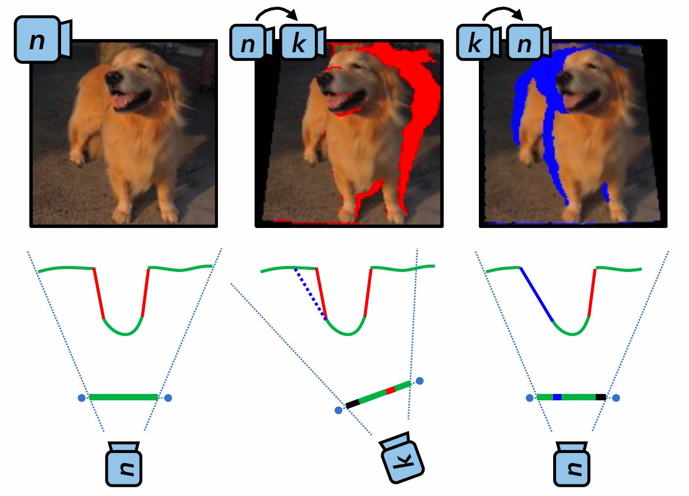
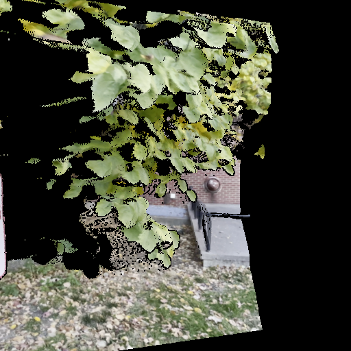
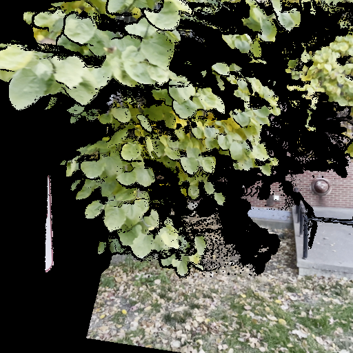

# WarpMasking

An efficient implementation of warp masking. The warping is randomly sampled from several pre-defined types (orbit, pan, moving).

The main idea come from "3D-aware Image Generation using 2D Diffusion Models" (ICCV2023), using forward-backward warpping to build warping masks.



## TODO List
- [] Replacing `cupy` in `softmax_splatting` with other methods (the building of `cupy` is so slow).

## Setup

```
conda create -n warp_mask python=3.10
conda activate warp_mask

pip install -r requirements.txt

# install pytorch3d
git clone https://github.com/facebookresearch/pytorch3d.git
cd pytorch3d && python setup.py install
```

Download `depth_anything_v2_vitl.pth` from [here](https://huggingface.co/depth-anything/Depth-Anything-V2-Large/resolve/main/depth_anything_v2_vitl.pth) and put it to `ckpts/depth_anything_v2_vitl.pth`.

## Usage

Please run `warp_mask_demo.py` for a fast try.


| Input image                     | Masked image (forward)             | Masked image (forward-backward)             |
|---------------------------------|------------------------------------|---------------------------------------------|
|  |  |  |

